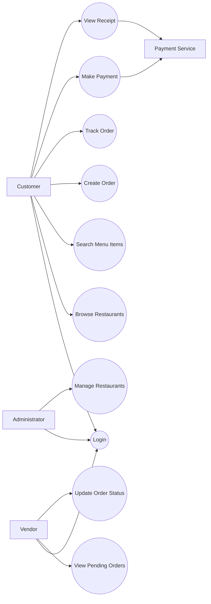
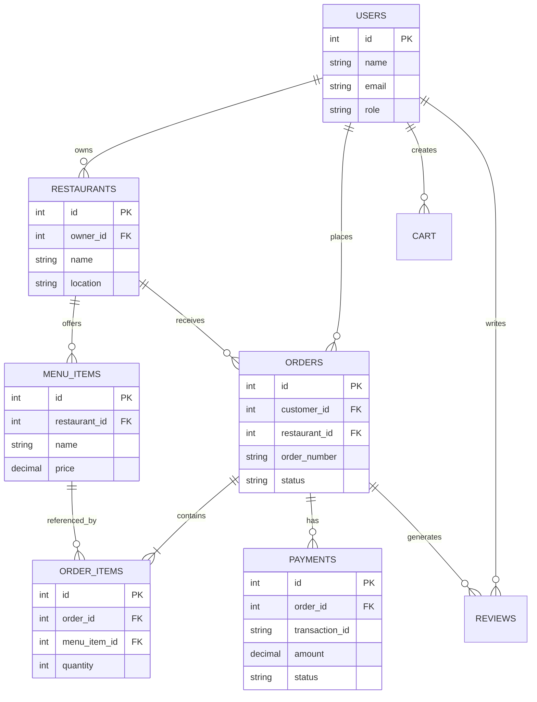
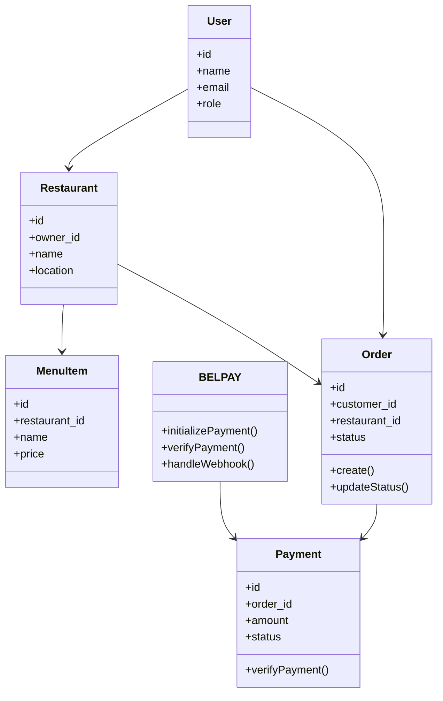
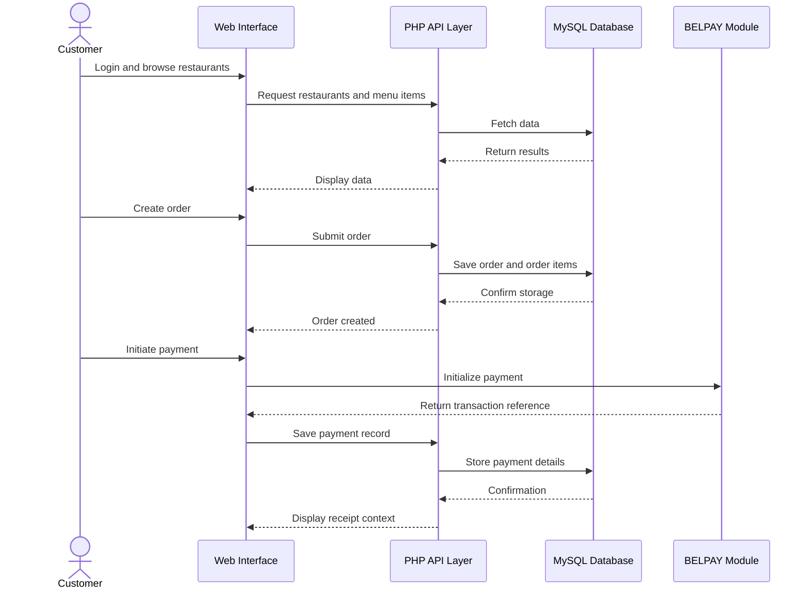

# DEVELOPMENT OF A UNIVERSITY RESTAURANT MANAGEMENT SYSTEM WEB APPLICATION

## CERTIFICATION
This is to certify that this internship report, titled **“Development of a University Restaurant Management System Web Application”**, is the original work of **MONJHUH PHOEBE BELOLE** with Matriculation Number **26CSN0113**, carried out in partial fulfillment of the requirements for the award of the Higher National Diploma (HND) in **Computer Science and Network Engineering** at **Vishi Higher Institute**.

We further certify that the work was carried out under our supervision and is approved for submission.

## DEDICATION
This report is dedicated to my late grandmother, **MAMA HANNA BELOLE ELANGWE**.

## ACKNOWLEDGEMENTS
I would like to express my sincere gratitude to everyone who contributed to the success of my internship and the completion of this report.

First, I thank God Almighty for giving me the strength, knowledge, and ability to successfully complete my internship training.

I would like to express my sincere appreciation to the management and staff of **CodingHQ** for giving me the opportunity to carry out my internship in their organization and for providing a conducive learning environment.

I would like to thank my professional supervisor for his guidance, support, and encouragement throughout the internship period. His advice and technical assistance helped me understand backend development, Python programming, and API integration.

I also express my gratitude to my academic supervisor for his guidance and support in the preparation of this internship report.

Finally, I would like to thank my family and friends for their encouragement, support, and motivation throughout my internship period.

## ABSTRACT
This report presents the activities carried out during an industrial internship at CodingHQ and the design and implementation of a University Restaurant Management System developed as part of practical training in backend software development. The internship focused on Python programming, backend web development, API integration, authentication systems, file handling, and software project development, during which several projects were completed including a Student Records Manager, an Authentication System, API testing using Postman, a Job Search Application using external APIs, and a final system project. As part of the practical application of backend development concepts, a web-based University Restaurant Management System was designed and implemented using PHP, MySQL, HTML, CSS, and JavaScript with a layered architecture consisting of presentation, application/API, and data layers. The system supports multi-role operations including administrator, vendor, and customer dashboards, order lifecycle management, payment workflow, and receipt generation with verification metadata adapted to local mobile-money payment environments. The conceptual roots of the project came from two major internship experiences: a hackathon project based on an online market management system built with Python as the backend, and the final internship project titled **BelPay**, a utility bill payment application that uses Python as the backend to support electricity bills, water bills, and television subscriptions. These two projects influenced the design of the present system, especially the marketplace logic and payment-handling approach. Although Python was the language studied during the two-month internship period, the final academic version of the restaurant system was implemented in PHP for academic and deployment reasons. The case study for the report focused on **Vishi Restaurants, Top Rank Plaza, and Mejom Restaurant**. The developed solution demonstrates backend development principles, modular system design, role-based access control, payment integration, and database-driven application development. The results show that the project successfully bridges the gap between theoretical learning and practical software engineering experience.

## RESUME
Ce rapport presente les activites realisees lors du stage industriel effectue a CodingHQ ainsi que la conception et l'implementation d'un University Restaurant Management System developpe dans le cadre de la formation en developpement backend. Le stage etait axe sur la programmation Python, le developpement backend, l'integration d'API, les systemes d'authentification, la gestion de fichiers et le developpement de projets logiciels, au cours duquel plusieurs projets ont ete realises tels que Student Records Manager, Authentication System, API testing avec Postman, Job Search Application utilisant des API externes, et un projet final de systeme logiciel. Dans le cadre de l'application pratique des concepts backend, un systeme web de gestion de restaurant universitaire a ete concu et implemente avec PHP, MySQL, HTML, CSS et JavaScript en utilisant une architecture en couches comprenant la presentation, la couche application/API et la couche donnees. Le systeme prend en charge plusieurs roles, notamment administrateur, vendeur et client, ainsi que la gestion du cycle de vie des commandes, le processus de paiement et la generation de recus avec metadonnees de verification adaptees aux moyens de paiement mobile. L'idee du projet provient de deux experiences majeures du stage: un hackathon sur un systeme de gestion de marche en ligne avec Python comme backend, et le projet final de stage intitule **BelPay**, une application de paiement de factures d'electricite, d'eau et d'abonnements TV, egalement basee sur Python. Meme si Python etait le langage etudie pendant les deux mois de stage, la version academique finale du systeme a ete realisee en PHP pour des raisons pedagogiques et de deploiement. L'etude de cas a porte sur **Vishi Restaurants, Top Rank Plaza et Mejom Restaurant**. Le rapport montre ainsi comment la pratique du stage a permis de relier les connaissances theoriques au developpement reel d'un systeme logiciel.

## TABLE OF CONTENTS
- Certification
- Dedication
- Acknowledgements
- Abstract
- Resume
- Chapter One: General Introduction of the Report
- Chapter Two: Presentation of the Enterprise Where the Internship Was Carried Out
- Chapter Three: Project Description
- Chapter Four: Methodology, Implementation and Testing
- Chapter Five: Results and Analysis as well as General Conclusion of the Report

## LIST OF ABBREVIATIONS

| Abbreviation | Meaning |
| --- | --- |
| API | Application Programming Interface |
| DBMS | Database Management System |
| ERD | Entity Relationship Diagram |
| HND | Higher National Diploma |
| LAMPP | Linux, Apache, MySQL, PHP, Perl |
| MoMo | Mobile Money |
| PDO | PHP Data Objects |
| RMS | Restaurant Management System |
| UML | Unified Modeling Language |
| URMS | University Restaurant Management System |

## CHAPTER ONE: GENERAL INTRODUCTION OF THE REPORT

### 1.0 Introduction
Industrial training is an essential component of professional education in computer science and network engineering because it exposes students to real working environments and practical software development processes. It creates a bridge between classroom knowledge and real industry practice by allowing students to interact with tools, workflows, and challenges that cannot be fully understood through theory alone.

This report presents the internship experience acquired at **CodingHQ** and the design and implementation of a **University Restaurant Management System Web Application** developed as the major academic software project inspired by that internship. During the internship, emphasis was placed on Python programming, backend development, API integration, authentication systems, debugging, project presentation, and collaborative software practices.

### 1.1 Background of the Study
The increasing use of digital technology in commerce, service delivery, and enterprise management has changed how organizations operate. Restaurants, especially those serving universities and busy urban environments, increasingly require digital systems to manage menu publication, customer orders, operational tracking, and payment verification.

At the same time, modern backend development has become a key area of software engineering because it supports data processing, authentication, API communication, file handling, and interaction with external systems. During the internship, the major training language was Python, and this provided a strong conceptual foundation for solving backend-oriented business problems.

The present project was not developed in isolation. Its idea came from two important prior experiences during the internship:

1. A hackathon project based on an **online market management system** built with Python, which demonstrated how multiple sellers and products could coexist in one digital platform.
2. A final internship project titled **BelPay**, a Python-based utility bill payment application designed to support payment of electricity bills, water bills, and television subscriptions.

These experiences influenced the restaurant project in two major ways. The hackathon system contributed the multi-actor marketplace idea, while BelPay contributed the payment and receipt logic. However, for academic reasons, the final backend implementation of the restaurant system was changed from the initially expected Python approach to **PHP**.

### 1.2 Statement of the Problem
The selected case-study restaurants, namely **Vishi Restaurants, Top Rank Plaza, and Mejom Restaurant**, reflect operational conditions where customer service and restaurant workflow can become inefficient when activities are handled manually or semi-manually. Common challenges include:

- difficulty for customers to know available restaurants and menu items in advance;
- weak order tracking and poor status visibility;
- lack of centralized transaction and receipt records;
- limited digital support for restaurant operators;
- difficulty scaling service in a structured way.

These problems justify the need for a web-based restaurant management platform capable of supporting customers, vendors, and administrators within a single system.

### 1.3 Aim of the Study
The main aim of this study is to design and implement a University Restaurant Management System Web Application that improves restaurant visibility, order management, payment traceability, and operational coordination in a university-related environment.

### 1.4 Specific Objectives
The specific objectives are:

- to study the operational context of the selected case-study restaurants;
- to gain practical knowledge from internship training in backend software development;
- to design a multi-role restaurant management web application;
- to implement authentication, role-based dashboards, and order management modules;
- to integrate a payment workflow influenced by the BelPay project;
- to use database design and software modeling techniques to structure the system;
- to test and evaluate the resulting application in a local deployment environment.

### 1.5 Internship Objectives
The main objective of the internship was to gain practical knowledge and experience in Python programming and backend web development. The internship also aimed at exposing the intern to real-world software development processes and tools used in the industry.

The specific internship objectives included:

- learning Python programming fundamentals such as data types, loops, functions, and file handling;
- developing software applications using Python;
- learning file handling using text files and CSV files;
- developing authentication systems with password validation;
- understanding APIs and testing them with Postman;
- integrating APIs into Python applications using the `requests` library;
- learning Git and GitHub for version control and project management;
- understanding backend development concepts such as databases, REST APIs, authentication, and deployment;
- developing debugging and problem-solving skills;
- learning how to present a software project professionally.

### 1.6 Significance of the Study
This report is significant because it demonstrates how internship experience can directly influence academic software development. It shows the transition from internship training to the production of a structured academic project. It also contributes a practical example of how lessons from Python-based backend projects can be transferred into a PHP-based system without losing conceptual integrity.

### 1.7 Scope of the Study
The scope of the report covers:

- the internship experience acquired at CodingHQ;
- the presentation of the enterprise where the training took place;
- the design and implementation of the University Restaurant Management System;
- the use of PHP, MySQL, HTML, CSS, and JavaScript in the final implementation;
- the analysis of results and future improvement opportunities.

The report does not cover full production deployment, live third-party payment certification, large-scale delivery logistics, or enterprise-grade mapping services.

### 1.8 Definition and Interpretation of Terms

| Term | Definition |
| --- | --- |
| Backend Development | Server-side programming where application logic, authentication, data processing, and database interaction are handled |
| API | A set of rules that allows software systems to communicate with one another |
| Authentication | The process of verifying a user's identity before granting access |
| JSON | A data format used to store and exchange structured information between systems |
| Git | A version control system used to track source code changes |
| GitHub | An online platform for storing and managing projects using Git |
| Database | An organized collection of electronic data |
| REST API | A web service architecture using HTTP methods such as GET and POST |
| Virtual Host | A server configuration that allows a web application to be served through a custom hostname |

### 1.9 Conclusion
This chapter introduced the report by presenting the background of the study, the problem statement, project aims, internship objectives, significance, scope, and technical terms. It establishes the academic and practical context of the report. The next chapter presents the enterprise where the internship was carried out.

## CHAPTER TWO: PRESENTATION OF THE ENTERPRISE WHERE THE INTERNSHIP WAS CARRIED OUT

### 2.0 Introduction
This chapter presents the organization where the internship was carried out and describes the internship activities performed during the training period. It includes the historical background of the organization, organizational structure, aims and objectives, activities of the organization, and the internship experience including tasks performed, skills acquired, challenges encountered, and the comparison between theory and practice.

### 2.1 Historical Background and General Description of the Organization
**CodingHQ** is a software training and technology education organization that focuses on teaching programming, backend development, API integration, and software engineering skills. The organization provides practical training programs designed to prepare students for careers in software development and backend engineering.

CodingHQ was established to bridge the gap between theoretical education and practical software development skills required in the technology industry. Many students learn programming theory in school but lack direct experience in building real-world applications. CodingHQ responds to this gap through project-based learning, where trainees build real software projects and learn modern development tools and workflows.

The organization specializes in training in the following areas:

- Python programming;
- backend web development;
- API development and integration;
- database design;
- authentication and security systems;
- Git and GitHub version control;
- software project documentation and presentation.

### 2.2 Organizational Structure of the Organization
The organizational structure of CodingHQ is composed of management staff, technical supervisors, instructors, teaching assistants, and trainees.

| Position | Main Responsibility |
| --- | --- |
| Director / Program Manager | Oversees the organization and manages the training programs |
| Technical Supervisor | Supervises technical learning and project execution |
| Software Development Instructors | Teach programming, backend development, and related topics |
| Teaching Assistants | Support trainees during practical sessions |
| Interns / Trainees | Participate in learning, practical work, and project execution |

There is a close relationship between management and technical staff. Management defines training direction and objectives, while technical staff implement the training through lessons, supervision, and project reviews.

### 2.3 Aims and Objectives of the Organization
The main aim of CodingHQ is to train students and young developers in practical software development skills required in the technology industry.

The objectives of the organization include:

- training students in Python programming;
- teaching backend web development;
- teaching API development and integration;
- teaching database design and management;
- training students on Git and GitHub;
- developing software project development skills;
- encouraging problem-solving and critical thinking;
- preparing students for software development careers;
- bridging the gap between academic learning and industry practice.

### 2.4 Activities of the Organization
CodingHQ is involved in various software development training activities such as:

- programming training;
- backend development training;
- API testing and integration training;
- database training;
- software project development;
- version control training;
- project documentation and presentation training.

Students are assigned practical projects to help them gain real-world programming experience in a structured and progressive manner.

### 2.5 Internship Experience and Activities Carried Out
During the internship period, several projects and learning activities were completed in a structured order. These activities were designed to build technical competence gradually from simple backend tasks to more advanced system design.

| Activity | Description | Skill Focus |
| --- | --- | --- |
| Student Records Manager | Developed a system to manage student records using Python dictionaries, lists, text files, and CSV files | File handling, data structures, persistence |
| Authentication System | Developed a user registration and login system with password validation rules | Authentication, validation, user management |
| API Testing Using Postman | Tested a Joke API using RapidAPI and Postman | API requests, query parameters, JSON analysis |
| Job Search Application Using API | Built a Python application connected to an external job search API using the `requests` library | API integration, external services, JSON handling |
| Dev Challenge Project Presentation | Prepared and presented a software solution with problem statement, features, challenges, and future improvements | Documentation, communication, software presentation |

These internship activities played a direct role in shaping the final academic project. The job search and API tasks strengthened backend integration skills, the authentication project influenced login system design, and the final presentation culture helped structure the project report professionally.

### 2.6 Benefits from the Internship and Skills Acquired
The internship provided both technical and professional benefits. The main skills acquired include:

- Python programming;
- file handling;
- CSV file management;
- authentication system development;
- password validation and hashing concepts;
- API testing using Postman;
- API integration using Python;
- JSON data handling;
- error handling and debugging;
- Git and GitHub version control;
- backend development concepts;
- software project documentation;
- project presentation skills.

### 2.7 Problems Encountered During the Internship
Some difficulties encountered during the internship included:

- understanding API documentation;
- debugging Python programs;
- handling JSON data from APIs;
- using Git and GitHub commands effectively;
- writing password validation logic;
- installing and configuring Python libraries.

These problems were progressively solved through practice, documentation review, experimentation, and guidance from instructors and supervisors.

### 2.8 Comparison Between Theory and Practice
There were similarities and differences between classroom theory and internship practice.

**Similarities**

- programming concepts learned in school were directly used in project work;
- software development still followed theoretical stages such as design, implementation, and testing.

**Differences**

- practical programming required more debugging and troubleshooting than theory suggested;
- API integration demanded close attention to documentation and real response formats;
- version control played a far more important role in practice;
- security and validation issues became more critical in real project scenarios.

### 2.9 Relevance of the Internship to the Project
The internship was highly relevant to the development of the University Restaurant Management System. Python was the main backend language studied during the training period, and the initial expectation was to implement the final system using Python. The idea of a university restaurant system was derived from the marketplace structure used in the hackathon online market management system. Likewise, the payment logic of the final restaurant project was influenced by the BelPay utility bill payment application.

For academic reasons, the final backend was changed to PHP. Nevertheless, the internship remained the intellectual and practical foundation of the project because it shaped the problem-solving approach, the system logic, and the understanding of backend architecture.

### 2.10 Conclusion
This chapter presented CodingHQ as the enterprise where the internship was carried out, together with its background, structure, aims, activities, and internship learning outcomes. It also showed how the internship directly influenced the conception and execution of the project described in the next chapter.

## CHAPTER THREE: PROJECT DESCRIPTION

### 3.0 Introduction
This chapter presents the project itself, including its origin, business context, problem description, objectives, scope, requirements, system models, and data structures. The chapter shows how the internship experience was transformed into a concrete software project relevant to the selected case-study restaurants.

### 3.1 Background of the Project
The project is a **University Restaurant Management System Web Application** designed to support digital restaurant operations for customer ordering, vendor-side management, administrator supervision, and payment tracking.

The project was inspired by three main factors:

1. The operational challenges observed in **Vishi Restaurants, Top Rank Plaza, and Mejom Restaurant**.
2. The multi-vendor marketplace concept used in the internship hackathon online market management system.
3. The payment-flow inspiration derived from the internship final project **BelPay**.

### 3.2 Case Study Context
The project used the following establishments as practical references:

| Case Study Restaurant | Reason for Inclusion | Main Need Reflected in the System |
| --- | --- | --- |
| Vishi Restaurants | Represents a structured restaurant service environment | Better menu publication and transaction management |
| Top Rank Plaza | Represents a busy service context with multiple user interactions | Faster order handling and operational coordination |
| Mejom Restaurant | Represents a practical local restaurant case | Simpler order tracking and customer access |

### 3.3 Problem Description
The restaurants considered in this study face challenges that are common in food-service environments where processes are not fully digitized. These include weak menu visibility, slow or manual order handling, difficulty tracking payment status, limited operational monitoring, and insufficient administrative control across service actors.

The project therefore aims to provide a system that unifies customer ordering, vendor operations, administrative supervision, and payment traceability within a single web application.

### 3.4 Aim and Specific Objectives of the Project
The main aim of the project is to design and implement a web-based restaurant management system suitable for a university and urban food-service context.

The specific project objectives are:

- to support administrator, vendor, and customer roles;
- to allow customers to browse restaurants and menu items;
- to enable order creation, monitoring, and status updates;
- to support payment handling and receipt generation;
- to preserve transaction traceability through structured records;
- to create a maintainable and extensible system architecture.

### 3.5 Scope of the Project
The project covers:

- login and role-based routing;
- customer dashboard functionality;
- vendor dashboard functionality;
- admin dashboard functionality;
- order and payment workflows;
- receipt generation;
- database-backed restaurant, order, and transaction management.

Future features such as map navigation, advanced delivery support, and richer restaurant analytics are outside the current implementation scope.

### 3.6 Justification for the PHP Backend
The original expectation for the project was to use Python as the backend because Python was the language studied during the internship period. However, the final implementation was changed to PHP for academic reasons.

This change was made to align the project with the academic environment, available deployment stack, and demonstration requirements. Even though the implementation language changed, the design logic remained strongly influenced by the Python-based internship experience.

### 3.7 Functional Requirements

| ID | Requirement | Description |
| --- | --- | --- |
| FR1 | Authentication | The system must authenticate users securely |
| FR2 | Role Routing | The system must redirect users to role-based dashboards |
| FR3 | Restaurant Search | The system must allow browsing and searching of restaurants and items |
| FR4 | Order Creation | Customers must be able to create orders |
| FR5 | Order Tracking | The system must allow order status monitoring |
| FR6 | Vendor Management | Vendors must be able to access pending orders and update status |
| FR7 | Admin Control | Administrators must be able to supervise platform entities |
| FR8 | Payment Handling | The system must support payment initiation and traceability |
| FR9 | Receipt Generation | The system must provide receipt information after payment |

### 3.8 Non-Functional Requirements

| ID | Requirement | Description |
| --- | --- | --- |
| NFR1 | Usability | The interface should be understandable to non-technical users |
| NFR2 | Maintainability | The codebase should be modular and documented |
| NFR3 | Security | Session and role control must restrict unauthorized access |
| NFR4 | Scalability | The system should allow future extension |
| NFR5 | Deployability | The project should run in a LAMPP/XAMPP environment |
| NFR6 | Traceability | Orders and payments should maintain auditable records |

### 3.9 Actors in the System

| Actor | Role in the System |
| --- | --- |
| Customer | Browses restaurants, places orders, makes payments, views receipts |
| Vendor | Handles restaurant operations and order status updates |
| Administrator | Oversees the system and controls restaurant-level administration |
| Payment Service | Processes payment-related operations |

### 3.10 Use Case Diagram

### 3.11 Use Case Description Table

| Use Case | Actor | Input | Output |
| --- | --- | --- | --- |
| Login | All users | Credentials | Authenticated session |
| Browse Restaurants | Customer | Search or selection request | List of restaurants or items |
| Create Order | Customer | Selected items and delivery details | Stored order and line items |
| Make Payment | Customer | Payment details | Payment status and transaction reference |
| View Pending Orders | Vendor | Restaurant-linked session | Pending order list |
| Update Order Status | Vendor | Order identifier and status | Updated order lifecycle stage |
| Manage Restaurants | Administrator | Restaurant activation data | Administrative update |

### 3.12 Entity Relationship Diagram

### 3.13 UML Class Diagram

### 3.14 UML Sequence Diagram for Order and Payment Flow

### 3.15 Core Database Tables

| Table | Purpose | Important Fields |
| --- | --- | --- |
| `users` | Stores user identity and role data | `id`, `name`, `email`, `password`, `role` |
| `restaurants` | Stores restaurant records | `id`, `owner_id`, `name`, `location`, `is_active` |
| `menu_items` | Stores dishes and prices | `id`, `restaurant_id`, `name`, `price`, `is_available` |
| `orders` | Stores order transactions | `id`, `customer_id`, `restaurant_id`, `order_number`, `status` |
| `order_items` | Stores line items for each order | `id`, `order_id`, `menu_item_id`, `quantity`, `total_price` |
| `payments` | Stores payment records | `id`, `order_id`, `transaction_id`, `amount`, `status` |
| `cart` | Stores temporary user selections | `id`, `user_id`, `restaurant_id`, `menu_item_id`, `quantity` |
| `reviews` | Stores customer rating data | `id`, `order_id`, `customer_id`, `restaurant_id`, `rating` |

### 3.16 Conclusion
This chapter presented the project background, scope, objectives, requirements, actors, diagrams, and core database structure. It shows that the project is both technically grounded and contextually derived from the internship and the selected case-study restaurants. The next chapter presents the methodology, implementation approach, and testing procedures.

## CHAPTER FOUR: METHODOLOGY, IMPLEMENTATION AND TESTING

### 4.0 Introduction
This chapter explains how the system was approached from a methodological perspective and how it was implemented and tested. In accordance with the required chapter organization, the discussion begins with the system overview, then system analysis, before proceeding to development methodology, implementation details, and testing.

### 4.1 System Overview
The University Restaurant Management System is a web application designed to manage restaurant interactions across three main user groups: administrators, vendors, and customers. The system is built around a layered architecture and uses PHP for backend logic, MySQL for data persistence, and HTML, CSS, and JavaScript for interface rendering.

At a high level, the system performs the following operations:

- authenticates users and routes them by role;
- displays restaurants and menu items;
- supports order creation and status tracking;
- supports payment processing and receipt generation;
- allows vendors and administrators to perform role-specific actions.

### 4.2 System Analysis
System analysis was performed to identify actors, workflows, data requirements, and the main interaction points of the application. This analysis was based on the needs observed in the case-study restaurants and the practical backend experience obtained during the internship.

#### 4.2.1 Analysis of Users

| User Type | Main Need |
| --- | --- |
| Customer | Browse food options, place orders, track payments |
| Vendor | Receive and manage customer orders |
| Administrator | Oversee platform-wide restaurant activities |

#### 4.2.2 Analysis of Core Processes

| Process | Description |
| --- | --- |
| Authentication | Ensures secure access and role recognition |
| Restaurant Browsing | Allows discovery of restaurants and dishes |
| Order Processing | Handles creation, storage, and update of orders |
| Payment Workflow | Handles transaction data and receipt logic |
| Administrative Control | Supports high-level monitoring and actions |

### 4.3 Development Methodology
An iterative, module-first methodology was adopted. The project was developed in manageable phases so that each core module could be implemented, verified, and improved before the next one was added.

| Phase | Activities | Output |
| --- | --- | --- |
| Planning | Requirements identification and feature selection | Initial project direction |
| Analysis | Actor, data, and process analysis | Use cases and data models |
| Design | Architecture, diagrams, database structure | Technical design artifacts |
| Implementation | Coding of frontend, backend, and database features | Working application modules |
| Testing | Functional checks and validation | Verified behavior and corrections |
| Documentation | Report writing and technical explanation | Internship report and system docs |

### 4.4 System Architecture and Design
The system uses a layered architecture made up of:

- **Presentation layer** for interfaces;
- **Application/API layer** for business logic and request handling;
- **Data layer** for persistent storage.

| Layer | Main Components | Role |
| --- | --- | --- |
| Presentation | `index.php`, `login.php`, dashboards, static pages | User interaction |
| Application/API | `api/auth/login.php`, `api/orders/*`, `api/search.php` | Request processing and business logic |
| Data | MySQL tables and PDO access | Data storage and retrieval |
| Shared Services | `includes/functions.php`, `includes/BELPAY.php` | Reusable logic and payment integration |

### 4.5 Implementation

#### 4.5.1 Authentication and Session Control
The login system supports both direct form submission and API-based authentication. After validation, the session is established and the user is redirected to the appropriate dashboard depending on the assigned role.

| Step | Action | Result |
| --- | --- | --- |
| 1 | User enters credentials | Login request is created |
| 2 | Server validates credentials | User record is checked |
| 3 | Session variables are assigned | Authenticated session is created |
| 4 | Role-based redirect occurs | User reaches the correct dashboard |

#### 4.5.2 Role-Based Dashboards
The implemented dashboards are:

- **Admin dashboard** for administrative supervision;
- **Vendor dashboard** for restaurant-side management;
- **Customer dashboard** for ordering, payment, and receipt access.

#### 4.5.3 Order Management
The order module supports order creation, listing, item retrieval, search, pending-order retrieval, and status updates. This module is implemented through PHP API endpoints backed by MySQL tables.

#### 4.5.4 Payment and Receipt Workflow
The payment flow is influenced by the BelPay internship project. It uses payment metadata such as provider, checkout mode, integration mode, settlement profile, split-payment flag, reference, and verification data. This ensures that receipts are not just displayed, but also supported with traceable payment context.

| Step | Action | Output |
| --- | --- | --- |
| 1 | Customer selects payment option | Payment request begins |
| 2 | System initializes payment | Transaction reference generated |
| 3 | Payment data is stored | Database record created |
| 4 | Receipt is rendered | Customer sees payment result |

#### 4.5.5 Database Implementation
The system uses MySQL tables for users, restaurants, menu items, orders, order items, cart records, payments, and reviews. Foreign keys and relationships ensure consistency between restaurant data, users, orders, and payments.

### 4.6 Testing and Validation
Testing was performed to ensure that major modules worked correctly and consistently.

| Test Area | Test Method | Expected Result | Observed Result |
| --- | --- | --- | --- |
| Login | Valid and invalid credential testing | Users should authenticate correctly | Passed |
| Role Routing | Login under each role | Correct dashboard should open | Passed |
| Search | Query restaurant and menu data | Matching items should be returned | Passed |
| Order Creation | Submit new order data | Order should be stored successfully | Passed |
| Order Status Update | Vendor changes order state | Status should update correctly | Passed |
| Payment Workflow | Test receipt and payment context | Receipt should display payment data | Passed |
| Session Protection | Access restricted pages without login | Unauthorized access should be blocked | Passed |

Validation was also supported through:

- PHP syntax checks;
- browser-level interaction checks;
- curl and Postman-style endpoint verification;
- documentation consistency checks.

### 4.7 Tools and Technologies Used

| Category | Technologies |
| --- | --- |
| Backend | PHP |
| Internship training backend | Python |
| Frontend | HTML, CSS, JavaScript |
| Database | MySQL |
| Hosting | Apache / LAMPP |
| API Testing | Postman |
| Version Control | Git, GitHub |
| Payment Logic Inspiration | BelPay |

### 4.8 Methodological Limitations
The methodology focused on functional and architectural correctness in a controlled local environment. Advanced production concerns such as cloud deployment, high-concurrency performance testing, full external payment certification, and logistics automation were outside the current scope.

### 4.9 Conclusion
This chapter presented the system overview, system analysis, development approach, implementation structure, and testing procedures. It demonstrates that the project followed a clear and technically grounded process from analysis to validated implementation.

## CHAPTER FIVE: RESULTS AND ANALYSIS AS WELL AS GENERAL CONCLUSION OF THE REPORT

### 5.0 Introduction
This chapter presents the results obtained from the implementation of the University Restaurant Management System, analyzes system behavior, and concludes the report by summarizing the contribution of both the internship and the project.

### 5.1 Results Obtained
The implemented system successfully provides:

- role-based authentication and dashboard routing;
- restaurant and menu visibility for customers;
- order creation and order lifecycle tracking;
- vendor-side access to pending orders and order status updates;
- administrative supervision of platform entities;
- payment workflow with receipt generation and verification context.

### 5.2 Analysis of System Behavior

#### 5.2.1 Access Control Robustness
Role checks at page and API levels reduce the risk of unauthorized access. Session-based enforcement ensures that customers, vendors, and administrators only access functions relevant to their roles.

#### 5.2.2 Data Consistency and Traceability
The use of relational tables for users, restaurants, orders, order items, and payments improves consistency and traceability. Transaction references and payment records contribute to accountability.

#### 5.2.3 Maintainability of the Architecture
The layered architecture simplifies maintenance by separating the user interface, business logic, and database concerns. This supports future enhancement with minimal disruption to the whole system.

#### 5.2.4 Practical Relevance
The system is practically relevant because it responds to the needs observed in Vishi Restaurants, Top Rank Plaza, and Mejom Restaurant. It also demonstrates that internship-derived backend concepts can be adapted to solve a real academic project problem.

### 5.3 Comparative Interpretation Against Objectives

| Objective | Level of Achievement |
| --- | --- |
| Gain practical backend experience | Achieved through the CodingHQ internship |
| Design a restaurant management solution | Achieved through structured system design |
| Implement a multi-role application | Achieved through role-based dashboards and APIs |
| Integrate payment-oriented transaction handling | Achieved through BelPay-inspired workflow |
| Build a maintainable academic project | Achieved through modular PHP and MySQL architecture |

### 5.4 Challenges and Limitations
Although the current system is functional, some limitations remain:

- seller-uploaded product media is not yet fully handled in a more advanced production manner;
- the system does not yet include a delivery menu for customers far from restaurant locations;
- map-based restaurant discovery is not yet implemented;
- the restaurant dashboard can still be made more sophisticated;
- advanced analytics, audit logs, and production-grade payment webhook management remain future improvements.

### 5.5 Future Improvements
The following improvements are proposed for future versions of the system:

- addition of a **delivery menu** for customers who are too far from restaurant locations;
- integration of a **map feature** to help customers locate restaurants with ease;
- development of a more sophisticated **restaurant version and dashboard**;
- stronger analytics for vendors and administrators;
- more robust payment verification and logging;
- richer customer notification and recommendation features.

### 5.6 General Conclusion of the Report
This internship report has presented both the professional training experience acquired at CodingHQ and the design and implementation of a University Restaurant Management System Web Application. The internship focused mainly on Python programming, backend development, authentication, API integration, and software project presentation. These experiences provided the practical foundation for the final academic project.

The project itself was influenced by the internship hackathon online market management system and the BelPay utility bill payment application. While Python was the backend language studied during the internship and initially expected for the final project, the academic implementation was migrated to PHP. This change did not weaken the project; instead, it demonstrated adaptability and the ability to transfer software engineering concepts across technologies.

Based on the case studies of Vishi Restaurants, Top Rank Plaza, and Mejom Restaurant, the resulting system provides a meaningful digital solution for restaurant visibility, order handling, payment traceability, and multi-role management. The project therefore stands as both a practical software solution and a successful academic outcome arising from internship training.

### 5.7 Chapter Conclusion
This chapter presented the results obtained from the implemented system, analyzed its behavior against the original objectives, identified the main limitations of the current version, and outlined realistic future improvements. It also closed the report with a general conclusion showing how the internship experience at CodingHQ and the final academic project combined to produce a meaningful and technically grounded software solution.

## APPENDIX

### Appendix A: Core Database Tables

| Table | Key Fields |
| --- | --- |
| Users | `id`, `name`, `email`, `password`, `role` |
| Restaurants | `id`, `owner_id`, `name`, `location` |
| Orders | `id`, `customer_id`, `restaurant_id`, `status`, `total_amount` |
| Order Items | `id`, `order_id`, `menu_item_id`, `quantity`, `price` |
| Payments | `id`, `order_id`, `amount`, `payment_method`, `status` |

### Appendix B: Sample Endpoint Structure

| Endpoint | Method | Description |
| --- | --- | --- |
| `/api/auth/login.php` | POST | User authentication |
| `/api/orders/create.php` | POST | Create order |
| `/api/orders/list.php` | GET | Retrieve orders |
| `/api/orders/update_status.php` | POST | Update order status |
| `/api/search.php` | GET | Search restaurants and items |

### Appendix C: Tools and Technologies

| Category | Tools |
| --- | --- |
| Programming Languages | Python, PHP, JavaScript |
| Database | MySQL |
| Frontend | HTML, CSS |
| API Testing | Postman |
| Version Control | Git, GitHub |
| Development Environment | LAMPP / XAMPP |

## REFERENCES
1. Pressman, R. S. (2014). *Software Engineering: A Practitioner's Approach*. McGraw-Hill.
2. Sommerville, I. (2016). *Software Engineering* (10th ed.). Pearson.
3. Elmasri, R., & Navathe, S. (2015). *Fundamentals of Database Systems*. Pearson.
4. Silberschatz, A., Korth, H., & Sudarshan, S. (2019). *Database System Concepts*. McGraw-Hill.
5. Fielding, R. (2000). *Architectural Styles and the Design of Network-based Software Architectures*.
6. Duckett, J. (2014). *PHP & MySQL: Server-side Web Development*. Wiley.
7. Welling, L., & Thomson, L. (2017). *PHP and MySQL Web Development*. Addison-Wesley.
8. Grinberg, M. (2018). *Flask Web Development*. O'Reilly Media.
9. Chacon, S., & Straub, B. (2014). *Pro Git*. Apress.
10. OWASP. (2023). *Web Security Guidelines*.
11. MySQL Documentation. (2023). *MySQL Reference Manual*.
12. PHP Documentation. (2023). *PHP Manual*.
13. Python Software Foundation. (2023). *Python Documentation*.
14. Postman Inc. (2023). *Postman API Platform Documentation*.
15. Martin, R. C. (2017). *Clean Architecture*. Prentice Hall.
